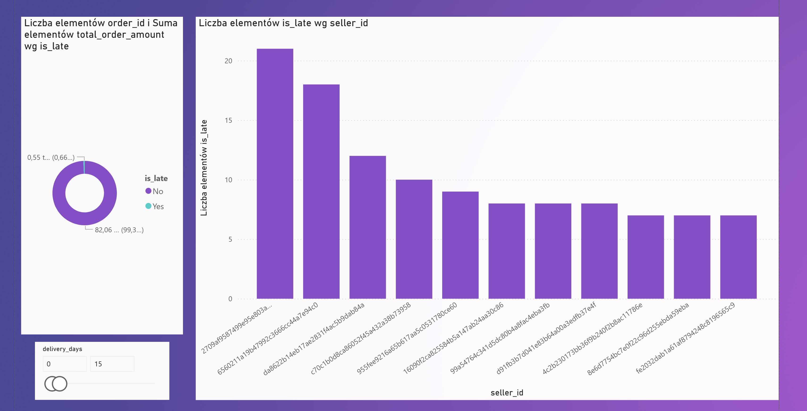
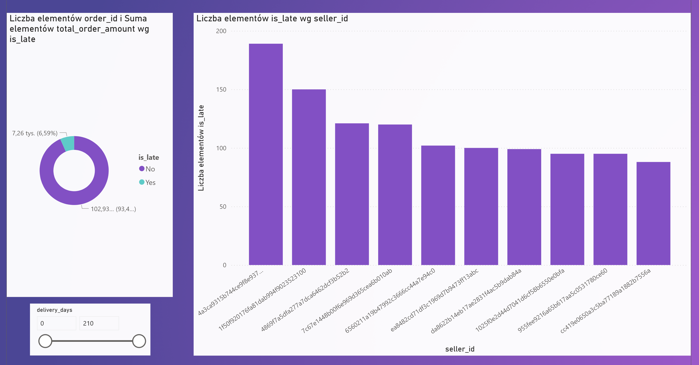
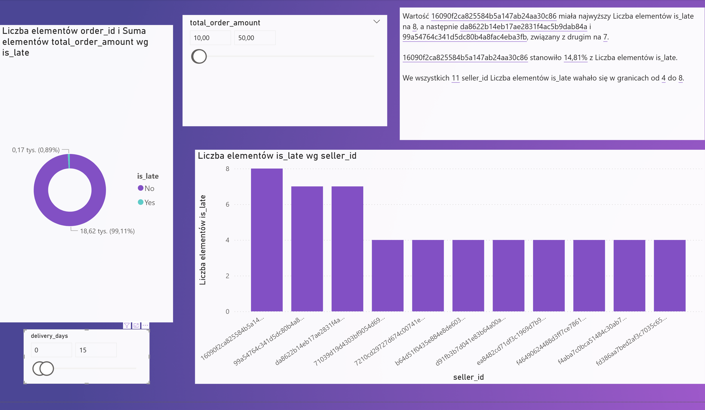

Problems Encountered & Solutions
During the Data Engineering and Analysis phase, several technical challenges were identified and resolved:

1. Data Import Issues (File Size & Formatting)
Problem: The standard Import Wizard in MySQL Workbench failed to process the large Olist datasets, and the import was repeatedly truncated due to encoding and line-ending mismatches.

Solution: Switched to high-performance SQL scripts using the LOAD DATA INFILE command. Optimized the process by identifying the correct line termination (\n for Unix LF) and field separators, which increased import speed by approximately 50x compared to the GUI wizard.

2. Excel Calculation Artifacts ("#VALUE!" Errors)
Problem: The source CSV files contained "dirty" data from previous Excel manipulations, specifically #VALUE! strings in columns intended for delivery time calculations.

Solution: Implemented a data cleaning pipeline in SQL using NULLIF() to neutralize Excel errors. Used the DATEDIFF() function to recalculate all delivery metrics directly within the database, ensuring 100% accuracy and consistency.

3. Schema Mismatch & Extra Columns
Problem: Some datasets contained extra columns added during manual analysis in Excel, leading to "Row truncated" errors (Error 1262) during the SQL import.

Solution: Developed a flexible import strategy using User Variables (@dummy). This allowed the SQL script to map only the necessary data columns while safely discarding redundant Excel metadata.

4. Logistical Anomalies (Data Insights)
Problem: Initial analysis revealed extreme outliers where shipping costs exceeded the product price by over 2000%.

Solution: Created a v_master_orders_report view to filter and categorize these anomalies, allowing for a more focused business analysis on shipping efficiency and regional price variances.

Business Insights: Order Financial Structure (pyt2)
Na podstawie analizy 20 przykładowych rekordów:

Zróżnicowanie udziału logistyki: Widzimy ogromne różnice w tym, ile transport "waży" w całkowitym koszcie zamówienia. Przykładowo, przy zamówieniu o wartości 109.90 BRL, wysyłka to 25.51 BRL (ok. 23%), ale przy tańszym produkcie za 14.99 BRL, wysyłka kosztuje 8.29 BRL, co stanowi aż 35% całkowitej kwoty.

Wysokie koszty wysyłki jako bariera: Niektóre pozycje wykazują bardzo wysoki koszt transportu (np. 85.97 BRL przy produkcie za 179.99 BRL). Sugeruje to, że gabaryty produktów lub odległości między sprzedawcą a klientem drastycznie podnoszą finalną cenę, co może zniechęcać klientów do finalizacji koszyka.

Wstępna korelacja opóźnień: W analizowanej próbce pojawiło się zamówienie spóźnione (is_late = 'Yes') o wartości 112.71 BRL. Choć to pojedynczy przypadek, w pełnej skali warto sprawdzić, czy droższe zamówienia (generujące większy zysk) nie są spóźnione częściej ze względu na bardziej skomplikowaną logistykę.

Analiza rentowności logistycznej (Shipping Efficiency) (pyt5)

Problem: Identyfikacja zamówień, w których koszt transportu drastycznie przewyższa wartość towaru.

Wynik: Zidentyfikowano przypadki, gdzie koszt dostawy stanowił ponad 2600% ceny produktu (np. produkt za 0.85 BRL z wysyłką za 22.30 BRL).

Rekomendacja: Wprowadzenie progu darmowej dostawy lub minimalnej wartości koszyka dla wybranych kategorii produktów.

Key Insights: Revenue Loss and Order Status Analysis (pyt3)
Na podstawie zestawienia statusów zamówień:

Wysoki koszt utraconych szans (Canceled Orders): To najważniejszy wniosek. Średnia wartość anulowanego zamówienia to aż 195.36 BRL, podczas gdy średnia dla zamówień dostarczonych (delivered) to tylko 139.93 BRL. Oznacza to, że klienci częściej rezygnują z droższych zakupów. Firma traci nie tylko wolumen, ale przede wszystkim najbardziej wartościowe transakcje.

Anomalie statusu "Unavailable": Choć takich zamówień jest tylko 7, ich średnia wartość jest rekordowa (305.78 BRL). Sugeruje to poważny problem z synchronizacją stanów magazynowych dla towarów luksusowych lub premium – klienci chcą je kupić, ale system po fakcie odkrywa, że towaru nie ma.

Dominacja statusu "Delivered": System sprawnie procesuje większość zamówień (110 197 rekordów), co świadczy o dużej skali operacyjnej, ale dysproporcja w średniej cenie między zamówieniami udanymi a anulowanymi sugeruje, że wysoka cena końcowa (cena + transport) może być głównym powodem rezygnacji.

Wąskie gardło "Shipped": Ponad tysiąc zamówień o średniej wartości 149.48 BRL ma status "wysłane". Warto monitorować ten segment, aby sprawdzić, czy nie utknęły one w logistyce, co mogłoby doprowadzić do kolejnej fali kosztownych anulacji.

Key Insights: Seller Logistics Performance Analysis (pyt6)
Na podstawie rankingu sprzedawców z największą liczbą spóźnień:

Identyfikacja "Problematic High-Volume Sellers": Lider rankingu (ID zaczynające się od 4a3ca...) wygenerował aż 189 spóźnionych zamówień przy łącznym wolumenie 1949 transakcji. Oznacza to, że niemal 10% jego wysyłek nie dociera na czas. Przy tak dużej skali operacyjnej, ten jeden dostawca znacząco obniża ogólny wskaźnik satysfakcji klientów (NPS) całej platformy.

Krytyczny wskaźnik opóźnień (Late-to-Total Ratio): Niepokojącym przykładem jest sprzedawca z ID 06a2c..., który ma 78 spóźnień na zaledwie 402 zamówienia. To niemal 20% spóźnień – dwukrotnie więcej niż lider wolumenowy. Taki wynik sugeruje systemowe problemy z procesowaniem zamówień lub nieprawidłowo ustawiony czas przygotowania oferty (lead time).

Wpływ na retencję klienta: Skumulowana liczba spóźnień dla pierwszej dziesiątki sprzedawców przekracza 1100 przypadków. Biorąc pod uwagę, że negatywne doświadczenie z dostawą jest głównym powodem rezygnacji z usług e-commerce, ci sprzedawcy bezpośrednio generują ryzyko odpływu klientów do konkurencji.

Rekomendacja: Wprowadzenie systemu ostrzeżeń dla sprzedawców, których wskaźnik opóźnień przekracza 15%. Dla liderów wolumenowych z dużą liczbą spóźnień zaleca się audyt procesów magazynowych w celu redukcji liczby skarg.

 - Największa ilość opóźnień przy dostawie trwającej 15 dni

 - Największa ilość opóźnień przez sprzedawce ogółem i wyszczególnienie tych sprzedawców

 - Największa ilość opóźnień dla transakcji między 10 a 50 dla maksymalnych spóźnień możliwych i wyszczególnienie tych sprzedawców

 - Największa ilość opóźnień względem max 15 dni trwania dostawy, dla transakcji między 10 a 50, wyszczególnieni sprzedawcy wg ilości opóźnień