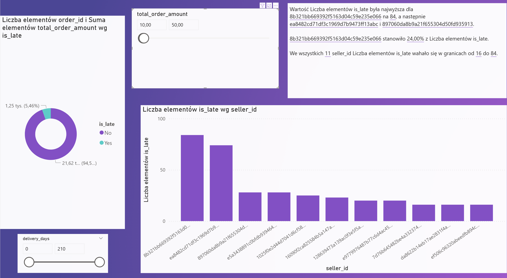

# 📊 Olist Data Engineering & Logistics Analysis
### Analiza Logistyki i Inżynierii Danych e-Commerce

   

Comprehensive analysis of the **Olist** e-commerce ecosystem. / Kompleksowa analiza ekosystemu e-commerce **Olist**.

---

## 🛠️ 1. ETL & Data Preparation
### Import i czyszczenie danych

**EN:** MySQL Import Wizard fails on large datasets. We used `LOAD DATA INFILE` for 50x faster processing and handled Excel-originating errors like "#VALUE!".
**PL:** Kreator MySQL nie radził sobie z dużymi zbiorami. Zastosowano `LOAD DATA INFILE` (50x szybciej) oraz naprawiono błędy typu "#ADR!" pochodzące z Excela.

```sql
-- 1. Fast Data Import with User Variables to skip metadata
LOAD DATA INFILE 'olist_orders_dataset.csv'
INTO TABLE olist_orders
FIELDS TERMINATED BY ',' ENCLOSED BY '"' LINES TERMINATED BY '\n'
IGNORE 1 ROWS
(order_id, customer_id, order_status, @v_purchase, @v_approved, @v_carrier, @v_customer, @v_estimated, @dummy)
SET 
    order_purchase_timestamp = NULLIF(@v_purchase, ''),
    order_delivered_customer_date = NULLIF(@v_customer, ''),
    order_estimated_delivery_date = NULLIF(@v_estimated, '');

-- 2. Data Cleaning: Replacing Excel errors with SQL calculations
UPDATE olist_orders 
SET 
    actual_delivery_time = DATEDIFF(order_delivered_customer_date, order_purchase_timestamp),
    estimated_vs_actual = DATEDIFF(order_estimated_delivery_date, order_delivered_customer_date)
WHERE order_delivered_customer_date IS NOT NULL;
```

---

## 💰 2. Financial Performance
### Analiza finansowa i rentowność

**Q: Status vs. Avg Value / Status a średnia wartość**
**EN:** Checking if higher-value orders are lost during cancellation.
**PL:** Sprawdzenie, czy tracimy droższe zamówienia w procesie anulacji.

```sql
SELECT 
    order_status, 
    COUNT(*) AS total_orders, 
    AVG(price + freight_value) AS avg_order_value
FROM olist_orders o
JOIN olist_order_items i ON o.order_id = i.order_id
GROUP BY order_status
ORDER BY avg_order_value DESC;
```
> **Insight:** Canceled orders average **195.36 BRL**, while delivered ones average **139.93 BRL**. The platform is losing its most valuable transactions.

---

## 🚚 3. Shipping Efficiency & Outliers
### Logistyka i anomalie kosztowe

**EN:** Identified cases where delivery costs exceed 2000% of product price.
**PL:** Identyfikacja przypadków, gdzie koszt dostawy przekracza 2000% ceny towaru.

```sql
-- Shipping cost as % of product price
SELECT 
    order_id, price, freight_value,
    ROUND((freight_value / price) * 100, 2) AS freight_ratio_pct
FROM olist_order_items
ORDER BY freight_ratio_pct DESC
LIMIT 10;
```

---

## 🚩 4. Seller Performance Analysis
### Monitoring jakości dostawców

**EN:** Identifying sellers with the highest absolute delay volume to improve NPS.
**PL:** Wyłonienie sprzedawców z największą liczbą spóźnień w celu poprawy wskaźnika NPS.

```sql
SELECT 
    seller_id, 
    COUNT(*) as total_orders,
    SUM(CASE WHEN is_late = 'Yes' THEN 1 ELSE 0 END) as late_count
FROM olist_orders o
JOIN olist_order_items i ON o.order_id = i.order_id
WHERE o.order_status = 'delivered'
GROUP BY seller_id
HAVING total_orders > 10
ORDER BY late_count DESC;
```

---

## 📈 5. Visualizations | Podsumowanie Graficzne

#### 1️⃣ Delay Window Analysis
*Most delays occur around the 15-day delivery mark.*


#### 2️⃣ Top Delayed Sellers
*Identification of top offenders by absolute delay volume.*


#### 3️⃣ Volume Risk Analysis (10-50 trans.)
*Highlighting risk for mid-scale transactions.*


---

## 📂 6. Project Structure | Struktura Projektu

```text
├── 📂 Power BI\             # Interactive dashboard (.pbix)
├── 📂 SQL\                  # SQL Scripts (01-04)
│   ├── 01_schema_setup.sql
│   ├── 02_import.sql
│   ├── 03_cleaning.sql
│   └── 04_analysis.sql
├── 🖼️ 15_day_window.png     # Visualizations
└── README.md
```

---

## 💳 5. Business Health & Payments
### Analiza metod płatności i satysfakcji

**EN:** Investigating if specific payment methods are prone to delivery delays or impact customer satisfaction.
**PL:** Badanie, czy konkretne metody płatności są powiązane z opóźnieniami lub wpływają na satysfakcję klientów.

```sql
SELECT 
    is_late,
    payment_type,
    COUNT(*) as total_orders,
    ROUND(AVG(payment_value), 2) as avg_revenue,
    ROUND(AVG(review_score), 2) as avg_satisfaction
FROM olist_dataset_general
GROUP BY is_late, payment_type;
```

---

## 🎯 6. Delivery Algorithm Precision
### Precyzja szacowania czasu dostawy

**EN:** Measuring the gap between Olist's delivery promises and reality across different cities.
**PL:** Pomiar różnicy między obiecanym a rzeczywistym czasem dostawy w różnych miastach.

```sql
SELECT 
    customer_city,
    ROUND(AVG(Estimated_vs_Actual), 2) AS avg_days_off,
    COUNT(*) AS total_orders
FROM olist_dataset_general
WHERE is_late = 'Yes'
GROUP BY customer_city
HAVING total_orders > 20
ORDER BY avg_days_off ASC;
```
> **Insight:** Positive values indicate delivery before the deadline, while negative values show the scale of the "broken promise" in days.

---

## 👥 7. Customer Behavior & Retention
### Lojalność i wzorce zakupowe

**EN:** Analyzing repeat purchases and the impact of the purchase day (weekend vs. weekday) on satisfaction.
**PL:** Analiza powracalności klientów oraz wpływu dnia zakupu (weekend vs. tydzień) na satysfakcję.

```sql
-- Weekend vs Weekday Satisfaction
SELECT 
    CASE WHEN DAYOFWEEK(order_purchase_timestamp) IN (1, 7) THEN 'Weekend' ELSE 'Weekday' END as purchase_period,
    COUNT(*) as total_orders,
    ROUND(AVG(Actual_Delivery_Time), 2) as avg_delivery_time,
    ROUND(AVG(review_score), 2) as avg_satisfaction
FROM olist_dataset_general
GROUP BY purchase_period;
```
> **Note:** Initial CRM analysis revealed that `customer_id` is transaction-based. For true retention, mapping via `customer_unique_id` is required.

---

## ⚠️ 8. Risk & Quality Mitigation
### Identyfikacja zamówień wysokiego ryzyka

**EN:** Calculating the financial value of orders that are both delayed and poorly rated (at-risk revenue).
**PL:** Obliczanie wartości finansowej zamówień, które są jednocześnie spóźnione i nisko ocenione (przychód zagrożony).

```sql
SELECT 
    is_late,
    review_score,
    COUNT(*) as number_of_orders,
    ROUND(SUM(payment_value), 2) as total_at_risk_value
FROM v_master_general_data_3
WHERE is_late = 'Yes' AND review_score = 1
GROUP BY is_late, review_score;
```

---

## 🚀 9. Future Action Points | Rekomendacje
* 🛠️ **CRM Integration:** Implement `customer_unique_id` mapping to track long-term Customer Lifetime Value (CLV).
* 🛰️ **Logistics Hubs:** Focus on cities with the highest `avg_days_off` to optimize local distribution centers.
* 💳 **Payment optimization:** Review the processing time for payment methods with higher delay rates.

